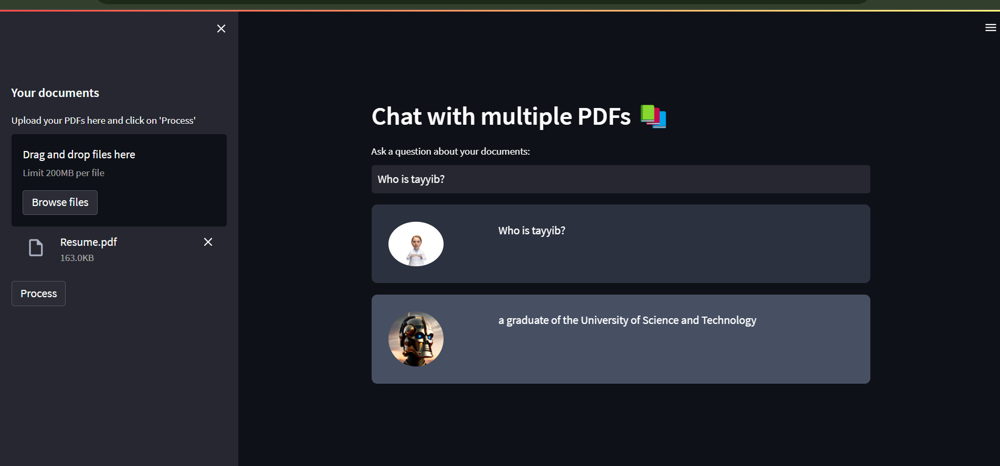

# ECG-RAG-Enhanced-Cardiovascular-Knowledge-Retrieval

A Retrieval-Augmented Generation (RAG) project to enhance the understanding of Large Language Models (LLMs) using ECG textbooks and clinical records.

## Note: 
Project yet incomplete...

### Current Frontend
